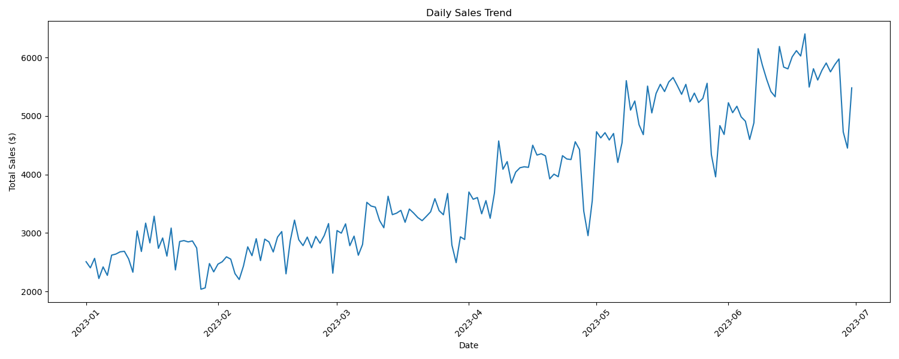
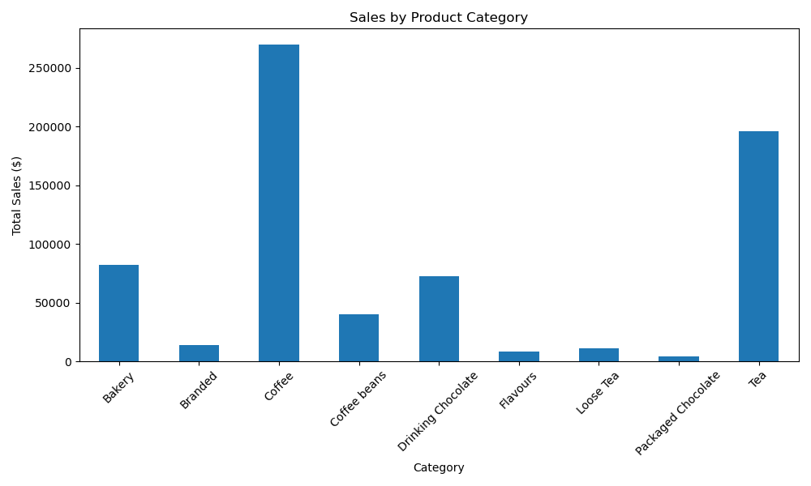
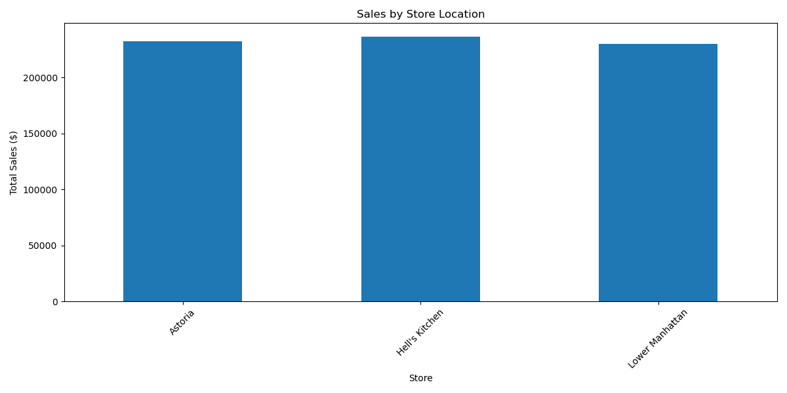
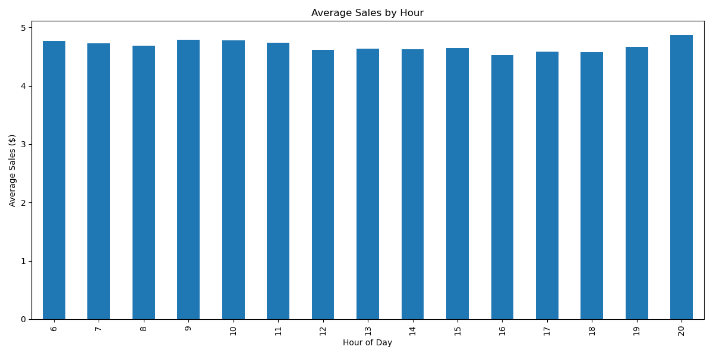

# Coffee Shop Sales Analysis

A comprehensive analysis of coffee shop sales data using a modular, production-ready approach.

## Key Insights

- **Total Sales**: $698,812.33
- **Average Daily Sales**: $3,860.84
- **Peak Sales Hour**: 10:00
- **Best Performing Category**: Coffee
- **Best Performing Store**: Hell's Kitchen

## Analysis Visualizations

### Daily Sales Trend

*Analysis of daily sales patterns showing revenue trends over time.*

### Product Category Performance

*Breakdown of sales by product category, highlighting top-performing categories.*

### Store Performance

*Comparison of sales performance across different store locations.*

### Hourly Sales Pattern

*Average sales distribution throughout the day, identifying peak hours.*

## Project Structure

```
├── config/                 # Configuration files
├── notebooks/             # Jupyter notebooks
│   └── coffee_shop_analysis.ipynb
├── reports/               # Generated analysis reports
│   └── figures/          # Generated graphics and figures
├── src/                   # Source code
│   ├── data/             # Data loading and handling
│   ├── preprocessing/     # Data preprocessing
│   ├── features/         # Feature engineering
│   ├── models/           # Analysis and modeling
│   ├── visualization/    # Visualization functions
│   └── utils/           # Utility functions
├── README.md             # Project documentation
└── requirements.txt      # Project dependencies
```

## Installation

1. Create a virtual environment (recommended):
```bash
python -m venv venv
source venv/bin/activate  # On Windows: venv\Scripts\activate
```

2. Install dependencies:
```bash
pip install -r requirements.txt
```

## Usage

The analysis is organized into modular components:

1. **Data Loading**: `DataLoader` class handles reading the raw data
2. **Preprocessing**: `DataPreprocessor` class handles data cleaning and initial processing
3. **Feature Engineering**: `FeatureEngineer` class creates additional features
4. **Analysis**: `SalesAnalyzer` class performs various analyses
5. **Visualization**: `SalesVisualizer` class creates insightful visualizations

### Running the Analysis

1. Open the Jupyter notebook:
```bash
jupyter notebook notebooks/coffee_shop_analysis.ipynb
```

2. Follow the notebook sections:
   - Data Loading
   - Data Preprocessing
   - Feature Engineering
   - Sales Analysis
   - Data Visualization
   - Customer Segmentation

## Features

- Comprehensive sales trend analysis
- Product performance metrics
- Store performance analysis
- Customer segmentation
- Time-based analysis
- Interactive visualizations

## Analysis Capabilities

- Daily and hourly sales patterns
- Product category performance
- Store location analysis
- Customer behavior analysis
- Sales growth trends
- Peak hours identification
